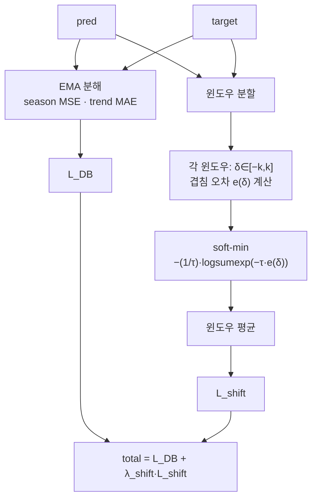

# Shift-Aware DBLoss

**NeurIPS'25 손실함수 DBLoss에 시간지연(shift) 항을 더해, 모양은 맞지만 위상이 어긋난 예측의 오차를 흡수하는 미분가능 시계열 예측 손실함수. (논문 심사중)**

-blue)

-8A2BE2)


> **출처 먼저.** 이 저장소는 공식 **DBLoss** 코드베이스(NeurIPS'25, *DBLoss: Decomposition-based Loss Function for Time Series Forecasting*, Qiu et al., ECNU) **위에 얹은 확장**이다. 원본 DBLoss 방법, `DECOMP`/`EMA` 분해 블록, 그리고 밑바탕이 되는 **TFB** 벤치마크 프레임워크는 원저자의 것이다(→ [참고](#-참고--인용)). 이 저장소의 기여는 `DBLossWithShift` 확장과 그 부속 shift-loss 함수다.

---

## 🎯 소개

**시계열 예측 손실함수 연구 프로젝트다.** MSE 같은 점별(point-wise) 손실은 예측을 매 시점마다 값 대 값으로 비교한다. 그래서 파형의 모양은 맞지만 시간축에서 조금 앞뒤로 밀린 예측을, 구조 자체가 틀린 예측과 똑같이 벌한다. 이 확장은 DBLoss의 계절/추세 분해 손실 위에, 작은 시간축 오프셋을 명시적으로 허용하는 **미분가능 shift-alignment 손실**을 더한다.

```
total_loss = DBLoss(pred, target) + λ_shift · L_shift(pred, target)
```

`L_shift`는 이산 시간 시프트에 대한 **soft-min**이라, "가장 잘 맞는 시프트"를 완전히 미분가능한 방식으로 고른다. 덕분에 모델을 end-to-end로 학습시키면서도 위상 정렬을 학습 신호에 넣을 수 있다.

이 저장소가 추가한 것:

- 🧩 **위상 오차 흡수**: 예측이 정답보다 몇 스텝 앞서거나 뒤처져도, 그 시프트를 보정한 오차를 손실로 쓴다.
- 🧠 **soft-min 미분가능화**: 미분 불가능한 `min` 대신 `logsumexp` 기반 soft-min으로 최적 시프트를 선택한다.
- 🪟 **윈도우별 piecewise 시프트**: 예측 구간을 윈도우로 쪼개 각 윈도우가 서로 다른 시프트로 정렬되게 한다.
- 🔌 **기존 파이프라인에 삽입**: 하이퍼파라미터 `loss="DBLossWithShift"` 하나로 PatchTST·DLinear·iTransformer·Amplifier에 그대로 붙는다.

---

## 🧩 문제 — 위상차(phase) 문제

주기성이 강한 시계열에서 모델은 파형의 **모양**은 잘 잡아도 **위상**을 조금 놓치는 경우가 많다. 예측 곡선을 시간축으로 몇 스텝만 밀면 정답과 거의 겹치는데, 점별 손실은 이 "밀림"을 인식하지 못한다.

- MSE/MAE는 시점 `t`의 예측을 시점 `t`의 정답하고만 비교한다. 예측이 한 스텝 늦으면 봉우리와 골이 어긋나면서, 모양이 옳은데도 큰 오차가 쌓인다.
- 결과적으로 손실은 모델에게 "파형을 뭉개서 평탄하게 만들라"는 신호를 준다. 위상을 맞추기보다 진폭을 줄이는 쪽이 손실이 낮아지기 때문이다.
- DBLoss는 예측 구간을 계절/추세로 분해해 각각 손실을 매기지만, 분해 뒤에도 두 성분은 여전히 **동일 시점끼리** 비교된다. 위상차 자체는 손실에 남는다.

이 확장의 가정: 손실이 작은 시간 오프셋을 허용하면, 모델이 진폭을 뭉개는 대신 위상을 맞추는 방향으로 학습된다.

---

## 🧠 방법 — DBLoss + 시간지연 항

전체 손실은 원본 DBLoss와 shift 항의 가중합이다.

```
total_loss = L_DB + λ_shift · L_shift
```

### 1) L_DB (원본 DBLoss, 재사용)

지수이동평균(EMA)으로 예측·정답을 각각 계절(season)과 추세(trend)로 분해한 뒤, 계절은 MSE로, 추세는 MAE로 손실을 매기고 `beta`로 가중한다. 두 성분의 스케일 차이는 `(season_loss / trend_loss)`를 `detach()`해 곱하는 방식으로 맞춘다. (이 블록은 원 저자 구현)

### 2) L_shift (이 저장소의 기여)

시프트 후보 `δ ∈ [−k, k]`마다, 예측과 `δ`만큼 민 정답 사이의 겹침 오차 `e(δ)`(MSE 또는 MAE)를 구한다. 미분 불가능한 `min` 대신, 온도 `τ`로 스케일한 **soft-min**을 쓴다.

```
L_shift = − (1/τ) · logsumexp( −τ · e(δ) )   ,  δ ∈ [−k, k]
```

- `τ → ∞`이면 `L_shift`는 하드 최소값(단일 최적 시프트)에 수렴한다.
- `softmax(−τ·e(δ))` 가중치로 **추정 시프트**(`delta_soft`)를 미분가능하게 뽑아 관찰용으로 노출한다.
- **윈도우 버전**은 위 계산을 길이 `window_size` 윈도우마다 적용하고 평균한다. 예측 구간의 부분마다 서로 다른 오프셋으로 정렬될 수 있다. 학습에는 이 윈도우 버전(`compute_windowed_shift_loss_softmin`)을 쓴다.
- 전역 단일 시프트 버전(`compute_global_shift_loss_softmin`)도 구현돼 있으나 기본 손실에는 쓰지 않고 ablation/비교용으로 남겨 뒀다.

### 손실 계산 흐름



### 하이퍼파라미터

| 파라미터 | 의미 | 기본값 |
|---|---|---|
| `lambda_shift` | 전체 손실에서 shift 항의 가중치 | 1.0 (스크립트 실측 0.003~0.1) |
| `shift_k` | 최대 절대 시프트 후보 δ∈[−k,k]. horizon−1로 클램프 | 5 |
| `shift_window_size` | piecewise 시프트 추정용 윈도우 길이 | 32 (스크립트 32/64/96) |
| `shift_tau` | soft-min 온도 (클수록 하드 min에 가까움) | 10.0 (스크립트 0.5/1.0/2.0) |
| `shift_mode` | 시프트별 오차 지표 `"mse"` / `"mae"` | mse |

기여물은 전부 [`ts_benchmark/baselines/utils.py`](ts_benchmark/baselines/utils.py)에 있고, 트레이너([`deep_forecasting_model_base.py`](ts_benchmark/baselines/deep_forecasting_model_base.py))의 `loss="DBLossWithShift"` 분기로 연결된다.

---

## 🛠 기술 스택

| 구분 | 기술 |
|---|---|
| **언어** | Python 3.8 |
| **딥러닝** | PyTorch ≥ 1.11 |
| **손실함수(기여)** | `DBLossWithShift` (soft-min windowed shift + 원본 DBLoss) |
| **벤치마크 프레임워크** | TFB (decisionintelligence/TFB) 기반 확장 |
| **백본 모델** | PatchTST, DLinear, iTransformer, Amplifier |
| **데이터셋** | ETT(h1·h2·m1·m2), Electricity, Solar, Weather |
| **데이터·통계** | darts 0.25.0, pandas, numpy, scikit-learn, scipy, statsmodels |
| **병렬 실행** | Ray ≥ 2.6.3 |
| **리포트 UI** | Dash + dash-bootstrap-components (`ts_benchmark/report/report_dash`) |

---

## 📁 프로젝트 구조

```
ShiftLoss/
├── ts_benchmark/
│   ├── baselines/
│   │   ├── utils.py                          # ★ 기여: DBLossWithShift + shift-loss 함수
│   │   │     ├─ DBLoss / DECOMP / EMA        #   (원본: 분해 손실 블록)
│   │   │     ├─ compute_windowed_shift_loss_softmin   # ★ 학습에 쓰는 윈도우 shift 손실
│   │   │     ├─ compute_global_shift_loss_softmin     # ★ 전역 shift 손실 (ablation용)
│   │   │     └─ DBLossWithShift              # ★ total = L_DB + λ·L_shift 래퍼
│   │   ├── deep_forecasting_model_base.py    # ★ loss="DBLossWithShift" 분기·하이퍼파라미터 연결
│   │   ├── amplifier/                        # Amplifier 백본
│   │   └── time_series_library/              # PatchTST·DLinear·iTransformer 등 백본·레이어
│   ├── data/ · evaluation/ · report/ · utils/  # (원본 TFB) 데이터·평가·리포트·병렬
│   └── readme                                # 원본 DBLoss 프로젝트 README (보존)
├── scripts/
│   ├── run_benchmark.py                      # 실험 진입점
│   └── multivariate_forecast/                # 백본×데이터셋별 실행 스크립트(.sh)
│       ├── ETTh1_script/ · ETTh2_script/ · ETTm1_script/ · ETTm2_script/
│       └── Electricity_script/ · Solar_script/ · Weather_script/
├── config/                                   # rolling / fixed forecast 설정 JSON
├── docs/figures/                             # DBLoss.png, exp.png (원 논문 그림)
├── result/                                   # 실험 산출물 디렉터리 (현재 비어 있음)
└── requirements.txt
```

---

## 🧪 실험 · 결과

**실험은 준비돼 있고, 이 스냅샷에는 측정 수치가 포함돼 있지 않다.**

- ✅ 손실함수가 구현됐고 학습 파이프라인에 연결됐다(end-to-end 미분가능, 코드로 확인).
- ✅ 백본 **PatchTST·DLinear·iTransformer·Amplifier** × 데이터셋 **ETT·Electricity·Solar·Weather** 조합의 실행 스크립트가 [`scripts/multivariate_forecast/`](scripts/multivariate_forecast/)에 준비돼 있다. 예측 구간 96/192/336 위주로 per-horizon `lambda_shift`가 지정돼 있다.
- ⏳ `result/` 디렉터리는 현재 비어 있어 **이 저장소에는 MSE/MAE 벤치마크 수치가 없다.** 성능 주장은 위 스크립트를 직접 돌린 뒤에만 근거를 갖는다.
- ⚠️ `docs/figures/exp.png`는 **원 DBLoss 논문의 결과 표**이지, 이 확장의 측정치가 아니다.

> 상태: 관련 논문 **심사중**. 벤치마크 결과가 확보되면 이 표를 채운다.

| 항목 | 현황 |
|---|---|
| 손실함수 구현·연결 | 완료 (코드 검증) |
| 실행 스크립트 | 4개 백본 × 4개 데이터셋 준비 |
| 벤치마크 수치(MSE/MAE) | 미포함 (`result/` 비어 있음) |
| 논문 | 심사중 |

### 실행 방법

```shell
# (권장) Python 3.8
pip install -r requirements.txt
# 전처리된 데이터셋을 ./dataset 아래에 둔다 (원본 안내: ts_benchmark/readme)

# 어떤 실험에서든 --model-hyper-params 로 DBLossWithShift 선택
python ./scripts/run_benchmark.py \
  --config-path "rolling_forecast_config.json" \
  --data-name-list "ETTh1.csv" \
  --strategy-args '{"horizon": 96}' \
  --adapter "transformer_adapter" \
  --model-name "time_series_library.PatchTST" \
  --model-hyper-params '{"loss": "DBLossWithShift", "lambda_shift": 0.03, "shift_k": 5, "shift_mode": "mse", "shift_tau": 1.0, "shift_window_size": 96, "seq_len": 96, "horizon": 96}' \
  --gpus 0 --num-workers 1 --save-path "ETTh1/PatchTST"
```

---

## 📚 참고 · 인용

이 작업은 원본 DBLoss 저자와 TFB 벤치마크 없이는 성립하지 않는다.

- **DBLoss** — *DBLoss: Decomposition-based Loss Function for Time Series Forecasting*, NeurIPS 2025. ([arXiv:2510.14510](https://arxiv.org/pdf/2510.14510))
- **TFB** — Time Series Forecasting Benchmark, `decisionintelligence/TFB`.

```bibtex
@inproceedings{qiu2025DBLoss,
  title     = {DBLoss: Decomposition-based Loss Function for Time Series Forecasting},
  author    = {Xiangfei Qiu and Xingjian Wu and Hanyin Cheng and Xvyuan Liu and Chenjuan Guo and Jilin Hu and Bin Yang},
  booktitle = {NeurIPS},
  year      = {2025}
}
```

shift-alignment 확장을 사용한다면 이 저장소도 함께 링크해 주기 바란다.
